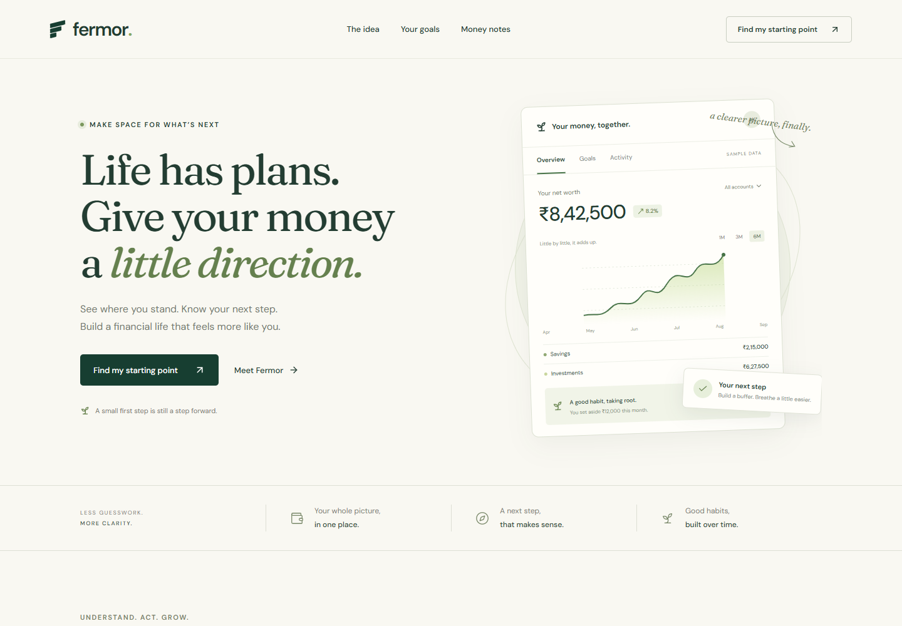
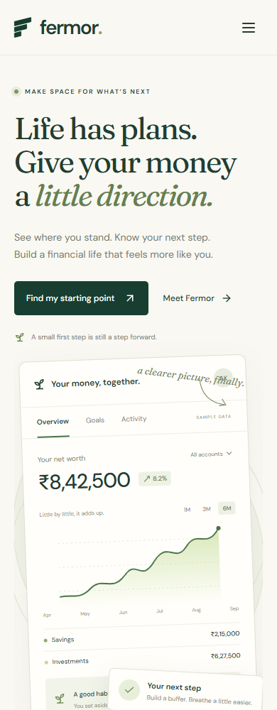

# Fermor homepage

A React homepage built for the Fermor Frontend Developer Assignment.

Live website: https://jayesh-waghmare.github.io/fermor-homepage/

Source code: https://github.com/Jayesh-Waghmare/fermor-homepage

## Screenshots

Desktop view at 1440 pixels.



Mobile view at 390 pixels.



## Run the project

Use Node.js 22.12 or later.

```bash
npm ci
npm run dev
```

Open the address printed in the terminal. To build and preview the production version:

```bash
npm run build
npm run preview
```

## What the page does

The sample dashboard has views for net worth, goals, and recent activity. You can switch the chart period to see a different sample trend.

The goals section lets you choose between an emergency fund, a trip, and a home. Changing the monthly contribution updates the time needed to reach the goal.

The main button opens a savings planner. Enter your income, expenses, target, and monthly contribution. The planner checks whether the contribution fits your budget and calculates the number of months needed.

The articles open in a reading window. The questions expand when selected, and the navigation has a menu on smaller screens. Tabs work with arrow keys, dialogs close with Escape, and keyboard focus stays visible.

## Why this layout

The dashboard comes first so visitors can see what bringing their finances together might look like. The next sections explain the idea, let them try a goal, and offer a few practical reading notes.

Cream and green keep the page calm. Fraunces is used for headings and DM Sans for body text and controls. Both fonts are included in the build. The illustrations use SVG and CSS, so there are no external image requests.

The content follows the brief and [Fermor's public description](https://www.linkedin.com/company/fermor/). The layout is an independent interpretation. The page does not use customer quotes, adoption figures, or promises about investment returns.

## What is included

This is a frontend concept. The dashboard figures and transactions are examples. There are no bank connections, accounts, or payment services.

The savings estimates assume regular contributions with no interest or investment returns. The planner starts from a zero balance. Inputs stay in the browser and are cleared when the page reloads.

The project uses React, Vite, plain CSS, and Lucide icons. It needs no backend or environment variables.

## Deployment

GitHub Actions builds the project and publishes the contents of `dist` to GitHub Pages when changes are pushed to `main`. GitHub Pages must use GitHub Actions as its source.

The relative asset paths also support hosting under a subdirectory. On Vercel or Netlify, use `npm run build` as the build command and `dist` as the output directory.

## Browser checks

Build the project and run `npm run preview`. In another terminal, run:

```bash
npm run test:e2e
```

The checks cover the dashboard, chart controls, goal calculations, planner validation, dialogs, articles, questions, and mobile menu. They also check for browser errors and horizontal scrolling at widths from 320 to 1440 pixels.

The tests use an installed Google Chrome. To use Playwright's Chromium instead, run `npx playwright install chromium` and set `PLAYWRIGHT_CHANNEL=chromium`. Set `TEST_URL` to test another address. Screenshots are saved in `tmp/qa`, which is excluded from Git.

Use `npm run format` to format the source.

## Submission

Share the live website and source code links at the top of this file. A short message is included in [SUBMISSION.txt](SUBMISSION.txt). Review it before sending it to the Fermor team.

The source archive contains the project files, README, submission message, and browser checks. It excludes installed dependencies and Git history. After extracting it, run `npm ci` and `npm run dev`.

The production archive contains the built website. Serve its contents through a static web server. Use the source project when you need to change the page.

Generated archives are kept in `output` and are not committed to the repository.
